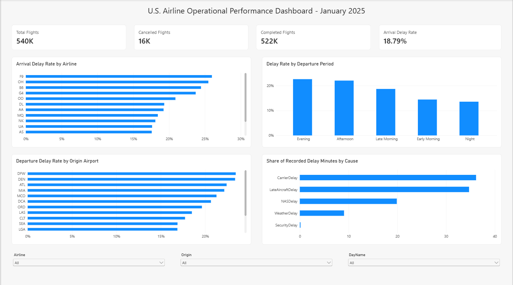

# Airline Operational Performance Analytics

**SQL · Python · Statistics · Power BI**

An end-to-end analysis of U.S. domestic airline operations using the U.S. Department of Transportation / Bureau of Transportation Statistics (BTS) Reporting Carrier On-Time Performance data for **January 2025**.

The project focuses on operational performance rather than machine-learning prediction: airline and airport delay patterns, cancellations, time-of-day effects, delay causes, inferential statistics, explanatory regression, SQL analytics, and an interactive Power BI dashboard.



## Dataset

The January 2025 BTS extract contains **539,747 flight records**. The raw BTS download has 110 fields; the project cleaning pipeline retains 51 analysis-ready fields and derives operational variables such as 15-minute delay flags, departure period, route, day name, and completed-flight status.

The full raw/cleaned datasets are intentionally **not stored in this repository** because of file size. A deterministic 25,000-row sample is included under `data/sample/` for schema inspection and demonstration. See `docs/DATA_SOURCE.md` for reproduction instructions.

## Main findings

| Metric | Result |
|---|---:|
| Total flights | 539,747 |
| Completed flights | 522,269 |
| Cancelled flights | 16,312 |
| Cancellation rate | 3.02% |
| Arrival delay ≥15 min among completed flights | 18.79% |
| Mean arrival delay | 3.76 min |
| Median arrival delay | -8 min |

Operationally, evening and afternoon departures showed the highest 15-minute arrival-delay rates, while early-morning flights performed substantially better. Recorded delay minutes were dominated by **Carrier Delay (~36%)** and **Late Aircraft Delay (~35%)**, followed by NAS delay (~20%) and weather delay (~9%).

Statistical testing found significant differences in mean arrival delay across major airlines (ANOVA, `p < 0.001`), although the effect size was small (`eta² ≈ 0.0053`). Cancellation was significantly associated with airline (Cramer's V ≈ 0.085), and departure period was significantly associated with 15-minute arrival delay (Cramer's V ≈ 0.0825).

The explanatory OLS model achieved `R² ≈ 0.969`. This is **not presented as a forecasting result**: departure delay is an operational precursor of arrival delay and accounts for much of the model fit.

## Repository structure

```text
Airline-Operational-Performance-Analytics/
├── README.md
├── data/
│   ├── sample/              # 25k-row reproducible sample
│   ├── derived/             # KPI/statistical output tables
│   └── data_schema.csv
├── python/
│   ├── 01_clean_bts_data.py
│   ├── 02_eda.py
│   └── 03_statistics.py
├── sql/
│   └── analysis_queries.sql
├── powerbi/
│   ├── Airline_Operations_Analytics.pbix
│   └── dashboard_preview.png
├── figures/
├── report/
│   ├── Technical_Report.pdf
│   └── Technical_Report.docx
├── docs/
│   ├── DATA_SOURCE.md
│   ├── METHODOLOGY.md
│   └── SQL_SETUP.md
├── requirements.txt
├── .gitignore
├── LICENSE
└── CITATION.cff
```

## SQL component

The SQLite analysis script contains 15 queries demonstrating:

- aggregations and KPI calculation
- `CASE WHEN`
- `GROUP BY` / `HAVING`
- CTEs
- airline and airport rankings
- window functions (`RANK`, `DENSE_RANK`)
- rolling 7-day averages
- route and distance-band analysis
- reusable SQL views

See [`sql/analysis_queries.sql`](sql/analysis_queries.sql).

## Statistical analysis

The Python workflow includes:

- descriptive statistics and 95% confidence intervals
- one-way ANOVA across major airlines
- eta-squared effect size
- chi-square association tests
- Cramer's V effect size
- explanatory multiple regression using operational predictors

The analysis explicitly distinguishes **statistical significance** from **practical effect size**, which is important with a dataset of more than half a million flights.

## Power BI dashboard

The interactive dashboard provides:

- total, cancelled and completed flight KPIs
- overall 15-minute arrival-delay rate
- airline delay-rate comparison
- departure-period comparison
- busiest-airport departure-delay comparison
- delay-cause composition
- airline, origin-airport and day-of-week slicers

The `.pbix` file is included under `powerbi/`.

## Reproduce the analysis

Install dependencies:

```bash
pip install -r requirements.txt
```

Clean the downloaded BTS CSV:

```bash
python python/01_clean_bts_data.py raw_bts_jan2025.csv BTS_Jan2025_clean.csv
```

Run EDA:

```bash
python python/02_eda.py BTS_Jan2025_clean.csv outputs/eda
```

Run statistical analysis:

```bash
python python/03_statistics.py BTS_Jan2025_clean.csv outputs/statistics
```

For SQL, import the cleaned CSV into SQLite as a table named `flights`, then run `sql/analysis_queries.sql`.

## Scope and limitations

This is a **January 2025 cross-sectional operational study**, not a full-year seasonality study. Weather is represented only through BTS delay-cause fields; no external meteorological data are merged. Airline and airport comparisons are observational and should not be interpreted as causal rankings. The regression is explanatory and includes departure delay, so it is not an independent pre-departure prediction model.

## Data source

U.S. Bureau of Transportation Statistics, Reporting Carrier On-Time Performance dataset. See `docs/DATA_SOURCE.md` for the official source and field notes.
